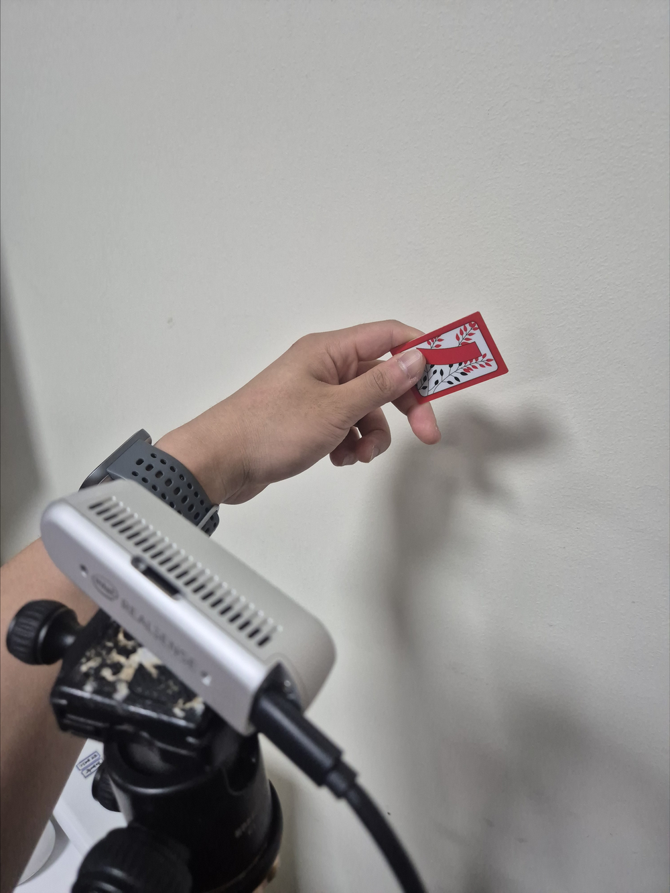
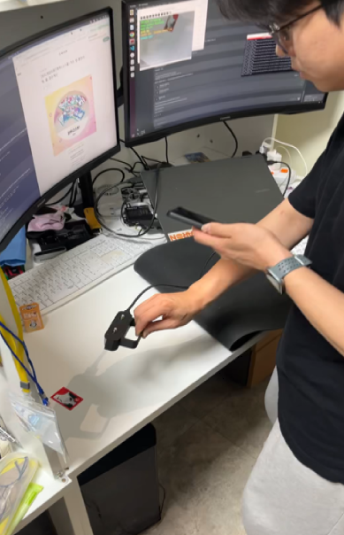
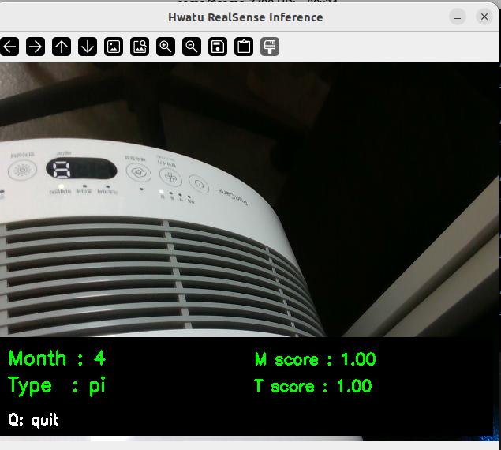
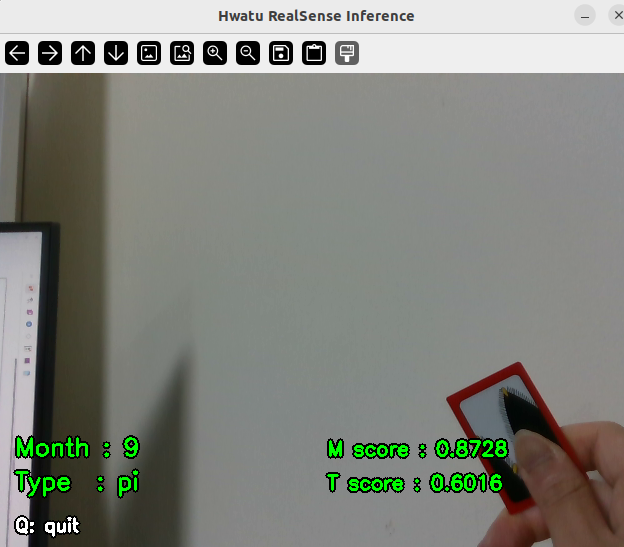
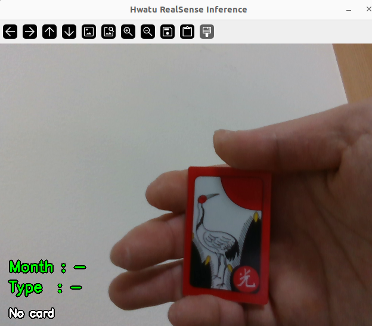
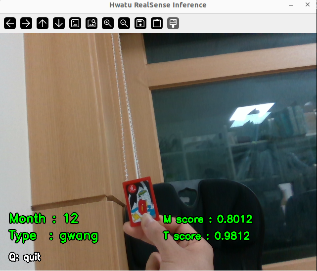
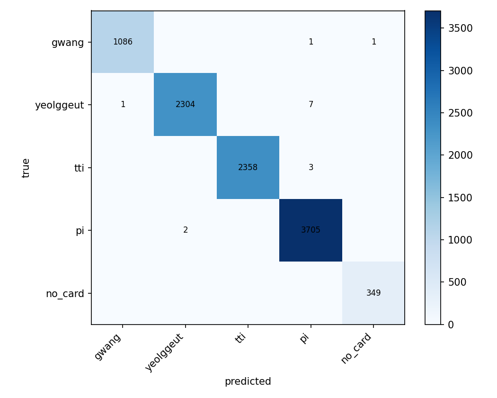
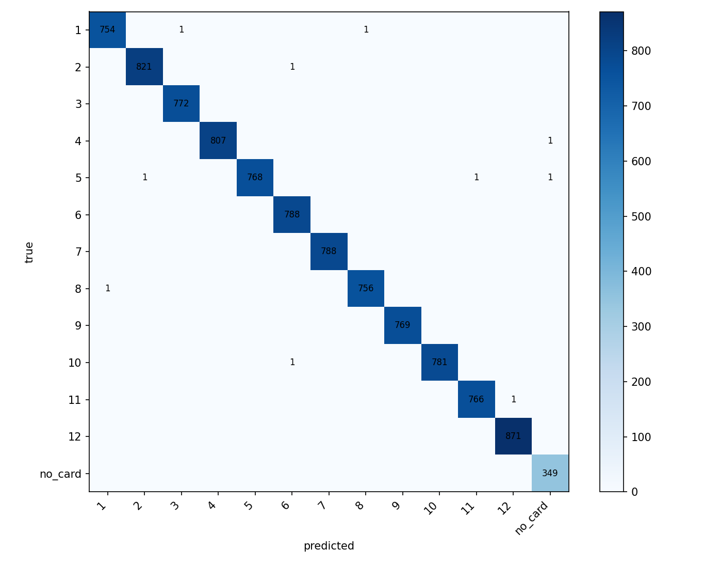
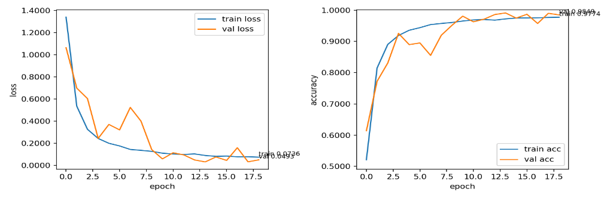
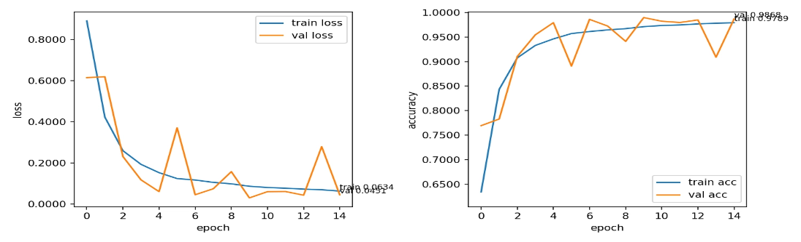

# ResNet 기반 화투패 실시간 분류 시스템

지능로봇기계학습 Term Project — RealSense 카메라로 화투패를 실시간 촬영해 분류하는 프로젝트.
입력된 한 장의 이미지에 대해 **month 모델**과 **type 모델**로 두 가지 분류를 동시에 수행한다.

> `machine_learning_class` 레포의 **`hwatu-project`** 브랜치. 학습/추론 코드와 **최종 모델 가중치
> 2개**(`checkpoints/month_final.pt`, `checkpoints/type_final.pt`)만 포함하며, 대용량 데이터셋과
> 실험용 체크포인트는 저장소에서 제외되어 있다.

## 1. 서론

목표는 RealSense 카메라로 화투패를 실시간 촬영하여 분류하는 것이다. 입력된 한 장의 이미지에 대해
두 가지 분류를 동시에 수행한다.

- **month 모델**: 1월~12월과 `no_card`로 이루어진 **13개 클래스**
- **type 모델**: 광 · 띠 · 열끗 · 피 · `no_card`로 이루어진 **5개 클래스**

같은 이미지 데이터셋을 사용하되 month label과 type label을 각각 다르게 사용하여, **두 개의
ResNet18 모델을 따로 학습**하였다. 월과 종류를 한 모델로 함께 맞히는 방법도 가능하지만, 포함하는
도메인을 구분하는 난이도와 혼동 양상이 서로 다르다고 판단하여 모델을 분리하였다.

| | Month 모델 | Type 모델 |
|---|------------|-----------|
| 클래스 수 | **13** (1~12월 + `no_card`) | **5** (광·열끗·띠·피 + `no_card`) |
| 특징 | 같은 종류라도 월마다 그림이 달라 **세밀한 차이**를 봐야 함 | 큰 특징만 봐도 비교적 쉽게 구분 |
| 난이도 | 클래스가 많아 type 대비 학습 난이도 ↑ | 광을 제외한 나머지 범주끼리 주로 혼동 |

## 2. 데이터셋 구축

### 2.1 폴더 구조와 라벨
이미지는 `data/raw` 폴더를 기준으로 저장하며, `labels.csv`가 각 폴더의 month/type label을 정의한다.
예를 들어 `data/raw/01/gwang`은 1월·광, `data/raw/06/tti`는 6월·띠, `data/raw/12/pi`는 12월·피이고,
`data/raw/no_card`는 카드가 없는 경우다. 같은 이미지 한 장이 month 모델과 type 모델 학습에 모두
사용되며, 폴더 경로에서 (월, 종류) 라벨을 함께 얻는다.

### 2.2 데이터 수집 환경
데이터는 RealSense 카메라로 직접 촬영하였고, 실시간 시연 환경이 다양하다는 점을 고려해 조건을
다양하게 하여 수집하였다.

- **배경**: 흰색 · 검정 · 알루미늄 프로파일 · 책상/매트/바닥 등 여러 배경
- **카드 위치**: 중앙뿐 아니라 좌·우, 위·아래, 대각선으로 옮겨 가며 촬영
- **카드 상태**: 정면, 기울임, 손가락으로 모서리 잡기, 일부 가림, 거리 변화까지 포함
- **no_card**: 카드가 아예 없는 경우, 손만 보이는 경우, 시연 배경만 보이는 경우로 나누어 수집

한 가지 조건만 학습하면 모델 구동 시 조건이 달라질 때 쉽게 무너지므로, 처음부터 여러 조건을
섞도록 계획을 세우고 실행하였다.

<p align="center">

<br/>
<em>데이터 수집 방법 — (좌) 손으로 카드를 가리는 상황 데이터 수집, (우) 다양한 각도·밝기에 대응하기 위한 데이터 수집</em>
</p>

### 2.3 최종 데이터 개수
여러 번 수집한 데이터를 병합한 결과, 최종 이미지 수는 **56,148장**이다. type 기준 클래스별 장수는
다음과 같다.

| 종류 | 장수 |
|------|-----:|
| 광 (gwang) | 6,520 |
| 열끗 (yeolggeut) | 13,442 |
| 띠 (tti) | 13,637 |
| 피 (pi) | 20,501 |
| no_card | 2,048 |
| **합계** | **56,148** |

month 기준으로는 1~12월이 각각 약 4,300~4,700장이며, 12월만 5,364장으로 조금 많고 `no_card`는
2,048장이다. 종류별로 보면 **피가 가장 많고 no_card가 가장 적어 약 10배의 불균형**이 있는데, 이는
화투 구성상 피가 많고 no_card는 인위적으로 추가한 클래스이기 때문이다.

## 3. 모델 및 학습 방법

### 3.1 모델 구조
모델은 **ResNet** 구조를 사용하였다. ResNet은 잔차(residual)를 기반으로 학습하기 때문에 기존의
특징을 보존하면서 차이를 더 잘 반영할 수 있으며, 이것이 화투 이미지의 특성과 잘 맞는다고 판단했다.
구현은 PyTorch와 torchvision의 **ResNet18**을 사용하였다. 사전학습 가중치는 사용하지 않았으며
(`weights=None`), **Dropout을 0.3** 정도로 두어 특정 뉴런에 과하게 의존하지 않게 하는 동시에
오버피팅을 방지하였다.

### 3.2 손실 · 최적화 · 클래스 불균형
- **손실 함수** CrossEntropyLoss, **옵티마이저** Adam, **weight decay** 1e-4, **batch size** 64.
  learning rate는 학습 단계마다 조금씩 다르게 설정하였다.
- **클래스 불균형**은 Data Loader의 `WeightedRandomSampler`로 완화하였다. sampler가 클래스 개수를
  자동으로 알지 못하므로, 코드에서 각 샘플의 weight를 **`1 / (그 클래스의 개수)`** 로 계산해 sampler에
  전달하였다. 그 결과 적은 클래스가 한 배치에 더 자주 등장하여 불균형이 완화된다. 이 sampler는
  **train에만 적용**하였고, validation은 sampler 없이 평가하였다.
- 불균형이 실제로 어떤 클래스에 영향을 주는지는 전체 정확도만으로 가려지므로, **confusion matrix와
  클래스별 accuracy를 함께 사용**하여 추론이 약한 클래스의 데이터를 보강하였다.
- **검증 분할**: 세션별 각 그룹에서 약 **20%를 validation set**으로 분리하였다. validation은 실제
  분포에서의 성능을 보기 위한 것이므로 augmentation을 적용하지 않고 resize와 normalize만 적용하였다.

### 3.3 Augmentation
augmentation은 저장하지 않고 학습할 때마다 즉석에서 적용하였다. 시연에서 거리·회전·원근감·손가락
가림 같은 변화가 크기 때문에 강한 augmentation을 다음과 같이 설정하였다.

| Augmentation | 역할 |
|--------------|------|
| RandomRotation(180) | 이미지 회전 |
| RandomPerspective(distortion_scale=0.45, p=1.0) | 이미지 뷰(원근) 변화 |
| RandomAffine(translate=(0.16,0.16), scale=(0.7,1.25), shear=(-14,14)) | 회전·평행이동·스케일링·전단 |
| ColorJitter | 색상·밝기 변화 |
| GaussianBlur | 노이즈/블러 추가 |

- **좌우반전(horizontal flip)은 제외**하였다. 화투 그림의 방향과 비대칭 자체가 월을 구분하는 단서가
  되어, 뒤집으면 라벨이 깨질 수 있기 때문이다.
- 강한 augmentation만 쓰면 원본 이미지가 그대로 학습되는 비율이 낮아지므로, 학습 시 **원본 40% ·
  약한 augmentation 40% · 강한 augmentation 20%**를 섞어 사용하였다.

## 4. 모델의 변천사 (발전 과정)

데이터셋과 모델은 한 번에 완성하지 않았고, 문제를 발견할 때마다 데이터를 추가하고 학습 전략을
바꾸며 크게 **네 단계**로 발전하였다.

| 발전 | 추가 데이터 | 학습 방법 | 문제점 및 개선사항 |
|------|-------------|-----------|--------------------|
| **1. Card만** | 초기 card-only 데이터 (no_card 미포함) | ResNet18(`weights=None`)으로 처음부터 학습 | 기본 분류는 됐으나, 카드가 없는 화면에서도 특정 month/type으로 예측 |
| **2. no_card 추가** | no_card 클래스 추가 | 동일 구조에 클래스 추가 (month 13 / type 5) | 빈 화면·배경 오동작 감소. 손·거리 변화엔 여전히 흔들림 |
| **3. + Hand-held / Finger** | 손·손가락으로 가리는 경우 | 기존 checkpoint에서 낮은 학습률로 추가학습 | 손이 보이는 상황 안정화. 손가락이 문양을 가리면 month가 흔들림 |
| **4. + Final Demo** | 손으로 잡는 상황 + 카드 없는 상황 추가 | mixed aug (원본40 / 약40 / 강20) | 시연 환경에 가까운 입력에서 안정성 개선 |

데이터 개수 추이: **32,549장(카드만) → 34,297장(+no_card) → 41,628장(+손) → 56,148장(+손가락).**
실행 후 문제가 보일 때마다 단계적으로 상황을 변화시켜 데이터를 추가하고, 학습률을 조정하며 이어
학습하는 방식으로 발전시켰다.

<p align="center">

<br/>
<em>(좌) 배경도 카드로 인식하던 모습 · (우) 손으로 가리니 제대로 추론하지 못하던 모습</em>
</p>
<p align="center">

<br/>
<em>(좌) 손으로 잡았더니 추론이 안 되던 모습 · (우) 최종 학습한 모델</em>
</p>

## 5. 결과 분석

최종 모델의 validation 결과는 다음과 같다. 두 모델 모두 best epoch의 checkpoint(validation loss가
가장 낮은 시점)를 사용하였다. 단, 이는 **최종 학습의 결과일 뿐 이전 학습들의 파라미터는 아니다.**

| 모델 | best epoch | val loss | val accuracy | correct / total |
|------|:---------:|:--------:|:------------:|:---------------:|
| type | 10 | 0.0071 | **0.9978** | 11,191 / 11,216 |
| month | 9 | 0.0043 | **0.9987** | 11,182 / 11,196 |

### 5.1 Confusion matrix와 클래스별 accuracy
전체 정확도만 보면 클래스별 약점이 가려질 수 있으므로 confusion matrix와 클래스별 accuracy를 함께
보았다. type의 클래스별 accuracy는 다음과 같다.

| 클래스 | correct / total | accuracy |
|--------|:---------------:|:--------:|
| gwang | 1,295 / 1,300 | 0.9962 |
| yeolggeut | 2,679 / 2,686 | 0.9974 |
| tti | 2,719 / 2,724 | 0.9982 |
| pi | 4,089 / 4,097 | 0.9980 |
| no_card | 409 / 409 | 1.0000 |

confusion matrix를 보면 남은 오분류는 한 클래스당 대부분 한 자릿수로, type에서는 **피와 띠를 서로
헷갈리거나 열끗을 피로 보는 경우**가 조금 남았고, 일부는 카드가 손가락에 가려져 no_card로
예측되었다.

<p align="center">

<br/>
<em>(좌) type 모델 confusion matrix · (우) month 모델 confusion matrix</em>
</p>

### 5.2 Training curve · 오버피팅 · early stopping 해석
학습 중 validation loss가 단조롭게 감소하지 않고 출렁이는 구간이 있었는데, 이는 **강한
augmentation, WeightedRandomSampler, Adam optimizer, 그리고 여러 촬영 상황이 섞인 validation
split**이 함께 작용해 나타난 것으로 볼 수 있다. 따라서 마지막 epoch가 아니라 **validation loss가
가장 낮은 best checkpoint**를 사용하였다. 또한 validation accuracy가 train accuracy보다 높고 val
loss도 더 낮은 것으로 보아, 일반적인 오버피팅과는 다른 양상임을 확인할 수 있었다.

<p align="center">
<br/>
<em>month 모델 loss · accuracy 학습 곡선</em>
</p>
<p align="center">
<br/>
<em>type 모델 loss · accuracy 학습 곡선</em>
</p>

### 5.3 한계 및 보완점
- **Overconfidence**: 모델이 답을 과도하게 확신하여 confidence 값이 높게 나오고, 그로 인해 순간적으로
  값이 튀는 경우가 발생했다 → **label smoothing**과 **temperature 조정**으로 완화 필요.
- **손에 의한 오판단**: 시연 당일에도 손 데이터가 들어가 순간적으로 잘못 판단하는 경우가 있었다.
- **거리 민감성**: 카메라와 카드 사이 거리 변화에 민감해, 너무 가까우면 제대로 분류하지 못한다.
- **ROI 미검출**: ROI를 따로 검출하지 않고 전체 프레임을 resize해 입력하므로 배경·손·위치 변화가
  함께 들어간다 → **카드 ROI를 먼저 검출해 crop한 뒤 ResNet에 입력**하면 배경·손의 영향을 줄일 수 있다.
- **클래스 증설/이어 학습**: 12·4 클래스에서 no_card를 더해 13·5 클래스로 늘리고 학습을 이어가는
  과정에서 오버피팅 위험이 있었다 → 별도 **scheduler로 학습 중 학습률을 조절**해 방지했어야 했다.
- **향후 계획**: 위 보완점을 적용하고, **다중 화투 분류 → 여러 패를 인식해 점수까지 계산**하는
  모델로 발전시킬 계획이다.

## 6. 코드 구조 & 사용법

```
src/hwatu/        config.py · data.py · model.py · analysis.py
scripts/          train.py · infer_realsense.py · capture.py · verify_dataset.py · analyze.py
checkpoints/      month_final.pt · type_final.pt   # 최종 모델만 포함 (Git LFS)
docs/             data_layout.md (데이터 폴더 규칙) · images/ (README 그림)
```

```bash
pip install -r requirements.txt

# 학습 (month / type 각각)
python scripts/train.py --target month
python scripts/train.py --target type

# RealSense 실시간 추론 / 시연
python scripts/infer_realsense.py            # 또는 --demo

# 데이터셋 점검 · 검증 결과 분석(confusion matrix 등)
python scripts/verify_dataset.py
python scripts/analyze.py --target type
```

데이터 폴더(`data/raw/<month>/<type>`)와 `labels.csv`는 §2.1 규칙대로 준비하고, 실행 시 `--root`
(또는 환경변수 `HWATU_ROOT`)로 경로를 지정한다 — 자세한 규칙은 [`docs/data_layout.md`](docs/data_layout.md).
대용량 이미지·실험용 체크포인트는 저장소에 포함하지 않으며, 최종 가중치 2개만 **Git LFS**로 관리한다.

## 7. 자료 출처

- ResNet 구조 이미지: https://daeun-computer-uneasy.tistory.com/85
- 화투 월 구분 이미지: https://happinesscup.tistory.com/165
- 화투 광·띠·열끗·피 구분 이미지: https://m.blog.naver.com/simrudduf/220217865616
- 11월 열끗 이미지: https://hottracks.kyobobook.co.kr/gift/detail/S000058580838
- 9월 열끗 이미지: https://www.yes24.com/product/goods/101560287
